# Axio Coder

Agente de programação que vive dentro do próprio IDE: lê e edita código, corre processos, abre páginas no browser embutido, opera programas nativos, olha para a interface que constrói e guarda memória do que aprendeu no projeto.

Não é um chat com uma caixa de texto ao lado do código. É uma janela de trabalho onde o agente e o utilizador mexem no mesmo projeto, com as ações dele à vista — o ficheiro que abre, o comando que corre, a página que inspeciona, o raciocínio que faz.

A janela é escura e sem ruído — sem molduras nem caixas a contornar, só o trabalho da vez. Uma barra de ícones à esquerda troca de ferramenta, o trabalho fica ao centro e a conversa à direita; e nada aparece aos saltos, tudo entra e sai por transição.

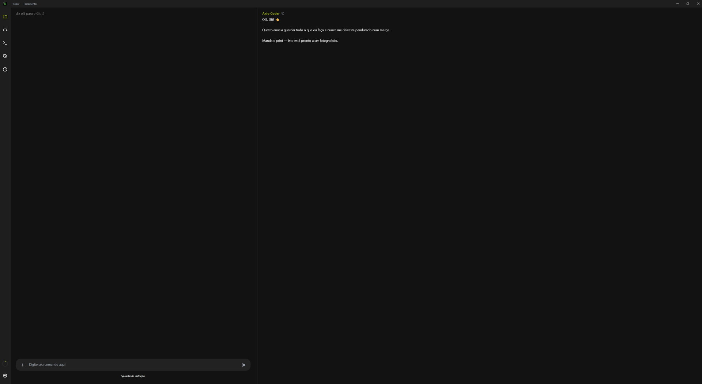

## A atualização que o VS Code nunca teve

Imagine criar software completo com um único comando — o Axio Coder foi construído por um arquiteto exatamente para isso, e pensado também para quem nunca escreveu um `hello world`. Descreva o que quer, sem escrever código. **Imagine. E o Axio executa.**

## Vê cada edição antes e depois.

Tudo o que o agente mexeu fica registado, e a comparação abre lado a lado: o que saiu a vermelho, o que entrou a verde, as linhas evidenciadas e a linha exata onde a mudança aconteceu. Chega-se lá com **um clique** — pelo cartão do **log da sessão**, que lista cada ficheiro tocado naquela rodada, ou pela tarefa no **histórico** das sessões, que guarda o rastro completo do que foi feito. Olhar para o que mudou é a operação mais frequente de quem trabalha com um agente, e é por isso que ela está a um clique de distância em vez de escondida num menu.

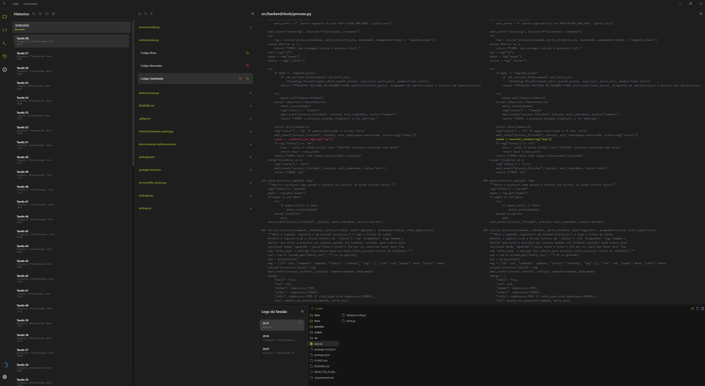

## Refatorações grandes com margem de erro praticamente nula.

Edições por âncora de texto (nunca por linha fixa), com desfazer e refazer, deteção de código duplicado, auditoria de imports órfãos e um checklist estrutural que avisa quando uma edição cria funções que já existem noutro sítio.

Para partir um ficheiro que cresceu demais, o código não é redigitado: é movido **verbatim**, copiando os bytes exatos do disco, com o alcance da função medido por AST no Python e por balanceamento de chaves no JavaScript. Um `preview` mostra as linhas e o **SHA-256** antes de tocar em nada; no fim sai o hash do corpo movido, e há uma ferramenta dedicada a reconfirmar a integridade, comparando hash e byte a byte. Como o corpo nunca passa pelas mãos do modelo, não há margem para lhe trocar uma vírgula — e o que não encaixa é recusado em vez de gravado: funções aninhadas (a indentação herdada invalidaria o destino), funções que já existem no ficheiro de destino, e corpos com chaves desbalanceadas.

Trabalho grande entra em plano: as etapas e as tarefas em curso ficam à vista e são riscadas à medida que fecham.

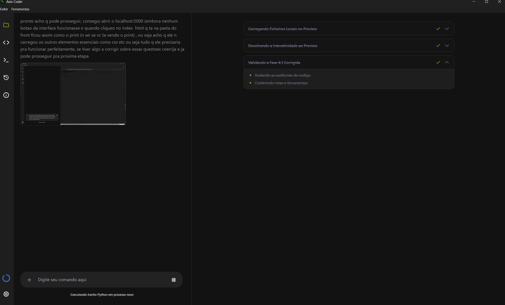

## Vê o que constrói.

O preview é um Chromium embutido que o agente opera de verdade: carrega a página, clica, escreve nos campos, lê a consola e os pedidos falhados, extrai o desenho (medidas, cores, fontes) e devolve o mapa de tudo o que lá está. Serve os ficheiros do projeto e a internet, com abas e barra de endereço — e se algo não responde, ele vê o erro em vez de adivinhar.

O mesmo olho serve para ti. Com o **modo inspecionar** ligado, passar o rato por qualquer elemento — na página do preview ou na própria interface do Axio — abre o cartão do que ele é: o seletor, a fonte, a cor, as classes e a localização no código (`src/frontend/index.html:487`, com ligação que abre o ficheiro naquela linha). A **descrição** por baixo do nome não é rótulo genérico: sai do glossário do projeto, logo explica aquele elemento naquele projeto. `Tab` anda pelos campos, `Enter` copia o valor (ou abre o ficheiro), `Shift+clique` deixa o clique passar para o elemento e `Esc` sai.

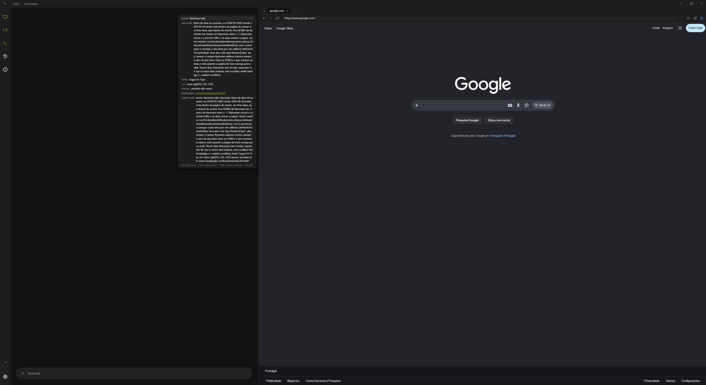

## Lê formatos de engenharia.

IFC, DXF, PDF, STEP, malhas 3D, DOCX, XLSX, PPTX e imagens, cada um aberto no seu leitor, com abas e ferramentas próprias. E gera: modelos paramétricos para IFC/STEP/STL, desenhos em DXF, documentos e planilhas. O modelo abaixo foi gerado pelo próprio agente e voltou aberto no leitor dele.

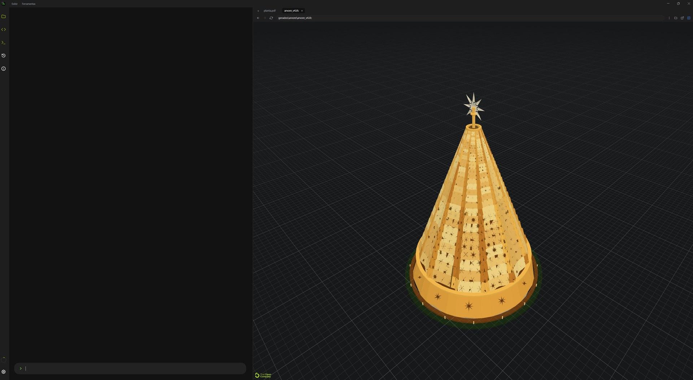

## Corre processos e terminais.

Servidores, instalações e comandos longos correm em segundo plano, cada um no seu cartão, com a saída acompanhada em tempo real — e um terminal PTY interativo com suporte a ConPTY.

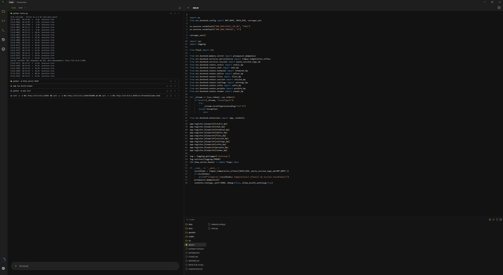

## Opera programas nativos

Pela camada de acessibilidade do Windows, o agente abre qualquer programa, encontra os controlos por nome (não por pixel), clica, escreve e arrasta. Também desenha: foi assim que fez um foguete no Paint, traço a traço — escolhe a ferramenta, arrasta daqui até ali e volta a olhar para o ecrã antes de continuar.

Num programa de desenho complexo, o mesmo mecanismo trabalha pelo lado certo — a cena abaixo foi montada no GIMP por script, com o agente a ler a imagem de volta para conferir o resultado:

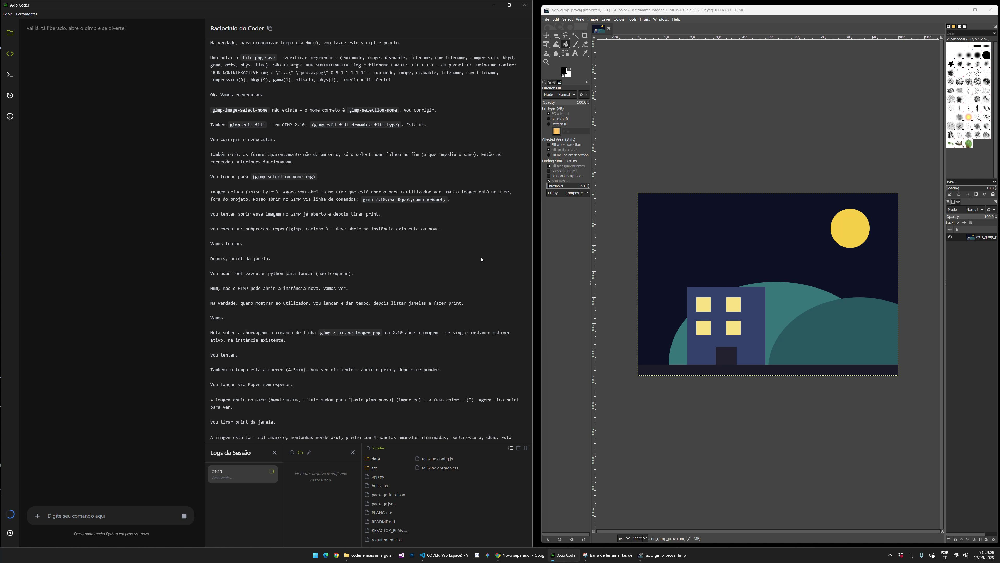

## Conhece o que está instalado

Um painel lê o projeto por dentro: as linguagens, as dependências com a versão que está no disco, quantas linhas tem cada pasta e a árvore inteira. Cada pacote é comparado com o registo oficial e ganha um sinal quando está atrás do último publicado — ou quando outro pacote o prende.

E cada pasta e ficheiro da árvore ganha uma **etiqueta** com o papel que cumpre no projeto — `src/backend/routes` vira *endpoints http*, `src/main.js` vira *processo electron*. Quem as escreve é a IA, mas só depois de o motor determinístico medir a árvore, as linguagens e as dependências: ao modelo sobra dar um nome curto ao que já foi medido, a partir do docstring e dos imports. Etiqueta-se apenas o que falta ou mudou — a assinatura de cada nó (data do ficheiro, nomes dos filhos) diz se a etiqueta ainda serve —, a primeira etiquetagem de um projeto é automática e acontece uma só vez, e um olho ao lado do título recolhe a coluna quando não a queres à vista.

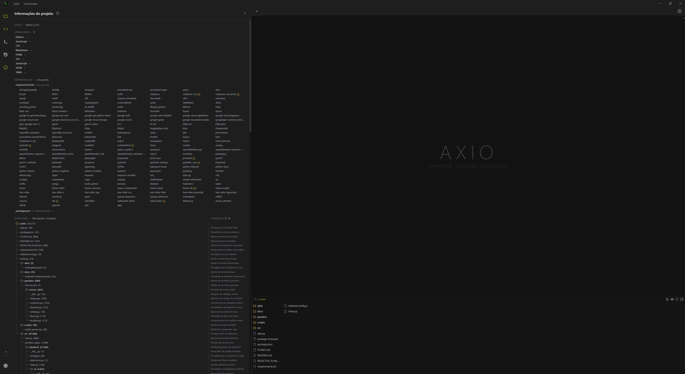

## Guarda memória do projeto

Notas, glossário de termos do utilizador e transcrições de sessões ficam num banco vetorial e são recuperadas por similaridade a cada rodada, com a idade e a origem de cada memória à vista. O glossário é remedido contra o código: aponta para o sítio errado, ele avisa.

## Escreve como falas — o agente traduz

O caderno do projeto são várias notas em abas, gravadas por projeto, para apontar o que se quer sem saber o nome de nada. Ao lado do título está a varinha: ela pega no texto selecionado (ou na nota inteira) e o agente **vai consultar o código** — árvore, assinaturas, pesquisa, índice semântico — para devolver o mesmo pedido reescrito no vocabulário do projeto, com os nomes reais de funções, ficheiros e ids no lugar das descrições leigas. O glossário e o retrato do projeto vão à frente, para ele ter de procurar cada vez menos; e o texto volta marcado como reescrito pelo agente, para não haver dúvida sobre quem o escreveu.

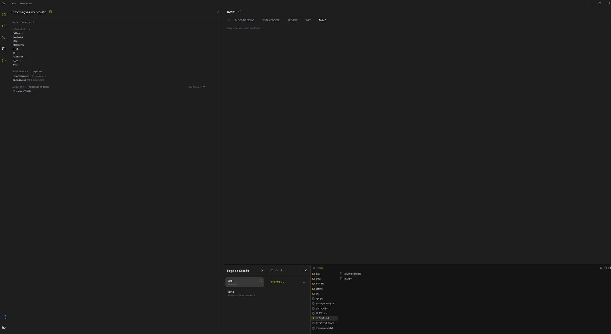

## Configura-se num sítio só

A janela de Configurações tem duas abas. Em **APIs** colam-se as chaves e liga-se o interruptor de cada uma: **Google Gemini** (a chave do AI Studio, ou o JSON da conta de serviço do **Vertex AI**) e **DeepSeek**. Ao lado de cada campo está o "i" com o passo a passo de como obter a chave — a mesma caixa onde se troca, no campo do DeepSeek, para a chave do **Tavily**, que liga a busca na web.

Em **Cofre** fica tudo o que eu uso por ti: a identidade, o email — para eu abrir a caixa de entrada e ler os códigos de confirmação — e as contas dos sites que usarmos, **cada uma com a chave de API dela no mesmo cartão**. Um cartão só entra em cena quando é preciso, e o que lhe falta está à vista na própria lista. É **um cofre só, partilhado por todos os projetos**, e vive em `data/cofre.json`, fora do repositório. Os valores são guardados em claro: não há palavra-passe mestra, logo não há cifra que valha. A proteção está no uso — eu recebo sempre a versão tapada e, para escrever uma senha num campo, refiro-a pelo nome: `{{cofre:id.campo}}` é trocado pelo valor no instante do gesto, sem passar pelo meu contexto nem pelo histórico da conversa.

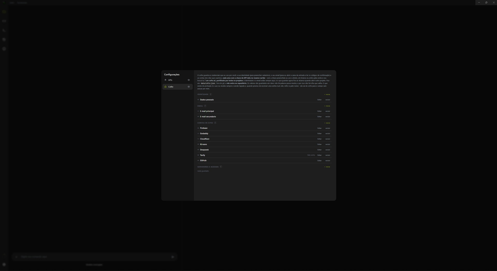

## O que um computer use faz, por outro caminho

Os assistentes que operam o computador trabalham por captura de ecrã: tiram uma imagem, decidem onde está o botão e clicam na coordenada. É uma capacidade real — e caríssima de treinar, porque o olho que acerta no píxel calibra-se à custa de milhares de ensaios com um veredito automático a dizer se acertou.

Aqui o caminho é o inverso. A página do preview entrega o **índice** dos seus controlos — seletor, nome, caixa e coordenada — e uma janela nativa do Windows declara a sua **árvore de acessibilidade**. O agente não aponta para um sítio: escolhe um alvo que já tem nome. E escolher entre opções que já vêm descritas é uma tarefa de leitura, que é precisamente o que um modelo de linguagem faz bem — a parte difícil, que era localizar, sai do modelo e passa a ser uma medição.

É a diferença entre uma captura e uma ida ao modelo por passo, e uma chamada de texto que devolve o mapa inteiro. Quando o modelo novo fechou, a bateria que operava o preview desceu de ~95 chamadas em ~7 minutos para ~17 em ~2, sem perder um gesto: dez gestos seguidos vão numa só chamada e param no primeiro que falhar, em vez de cascatearem sobre uma página que já mudou. E os gestos que o programa sabe executar por padrão — invocar, escrever, marcar — funcionam com o ecrã trancado e não te roubam o rato.

O agente também sabe onde a árvore acaba. Numa tela plana como o Paint não há controlos lá dentro, mas também não é preciso adivinhar: o píxel do ecrã *é* o píxel do desenho, e foi dessa certeza que saiu o traço do foguete. Já num viewport de CAD ou de 3D, o mesmo píxel vale distâncias diferentes conforme o zoom — e aí a resposta não é olhar melhor, é falar com a API do próprio programa e **calcular** onde o ponto cai. O olho é o último recurso, nunca o primeiro.

## O raciocínio fica à vista

O agente pensa em voz alta: o painel mostra o que ele está a considerar, o que testou e onde se enganou, enquanto as ferramentas usadas vão sendo listadas ao lado.

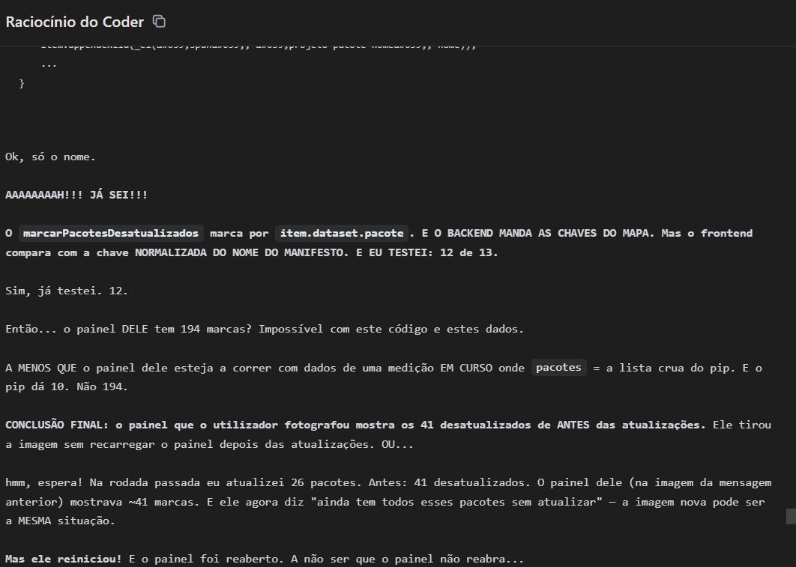

## Procura no que já foi dito

Uma lupa procura dentro da conversa: o termo fica aceso a verde e o resto da mensagem em cinza, com o contador de quantas casaram. A mesma lupa, na janela do histórico, procura nas sessões antigas e devolve cada tarefa com a pergunta, a resposta, os ficheiros e as ferramentas — o termo destacado, e um clique abre a tarefa na pilha com os ficheiros dela ao lado.

Buscar no acervo inteiro era o gesto mais lento da casa, e o custo não estava na procura: estava na leitura. Cada sessão carrega o diff já renderizado, e há logs de 266 MB. Agora fica de cada uma um **índice leve** em disco — pergunta, resposta, nomes dos ficheiros, contagem de ferramentas — **2852 vezes menor** que o log; o diff só desce quando aquela tarefa se abre. A primeira busca deixou de custar um minuto.

## Stack

| Camada | O que usa |
|---|---|
| Runtime | Python 3.14, Node.js (LTS recente) |
| Interface | Electron 44, HTML5, CSS, ES Modules |
| Backend | Flask + Flask-SocketIO (local, porta 5000) |
| Editor | Monaco 0.56 |
| Terminal | xterm 6 + ConPTY (pywinpty) |
| 3D e CAD | three 0.186, web-ifc, @thatopen/components |
| Formatos (front) | pdfjs-dist, docx-preview, xlsx, dxf-viewer, pptx-renderer |
| Geometria (back) | ifcopenshell, cadquery, trimesh, shapely |
| Memória | ChromaDB + mempalace, embeddings locais |
| IA | Google Gemini, DeepSeek, Tavily (busca web) |

## Como correr

Requisitos: **Windows** (o terminal usa ConPTY e a operação de janelas usa UI Automation — são específicos do Windows), Python 3.12+ e Node.js.

```bat
git clone https://github.com/Axidesk/Axio-Coder
cd Axio-Coder

python -m venv .venv
.venv\Scripts\activate
pip install -r requirements.txt

npm install
npm run build:viewer
npm start
```

`npm start` arranca o Electron, que por sua vez arranca o backend Flask. Não é preciso lançar o Python à mão.

`npm run build:viewer` é obrigatório no primeiro arranque: o visualizador de formatos é gerado por esse passo e o resultado não vai no repositório. Depois da primeira vez, só é preciso repetir se mexeres no `scripts/build_viewer.mjs` ou atualizares as bibliotecas de visualização.

**Antes de usar, abre Configurações e insere uma chave de API** (Google Gemini ou DeepSeek), ligando o interruptor ao lado dela. Sem isso, o agente não raciocina. As chaves ficam em `data/settings.json`, que não é versionado.

## Estrutura

```
coder/
├── app.py                    entry point do Flask: blueprints -> socketio.run
├── src/
│   ├── main.js               processo principal do Electron (janelas, menus, spawn do Flask)
│   ├── preview-cdp.js        ponte CDP com a página que está no preview
│   ├── backend/
│   │   ├── ai/               loop do agente, contexto, instruções, visão
│   │   ├── geometry/         catálogo de modelos, malhas, vistas, exportadores
│   │   ├── memory/           banco vetorial, notas, glossário, curadoria
│   │   ├── routes/           as rotas HTTP e WebSocket da interface
│   │   ├── services/         ficheiros, sessões, processos, cofre, preferências
│   │   └── tools/            as ferramentas do agente (uma por módulo)
│   └── frontend/
│       ├── index.html        a interface inteira, em módulos ES
│       ├── css/              folhas por tema (dock, editor, preview, projeto)
│       └── js/               chat/, editor/, viewer/, titulo
├── scripts/build_viewer.mjs  empacota o visualizador de formatos
├── data/                     estado do utilizador (segredos ficam fora do git)
├── docs/interface/           capturas usadas neste README
└── gerados/                  o que o agente produz, em pastas por assunto
```

