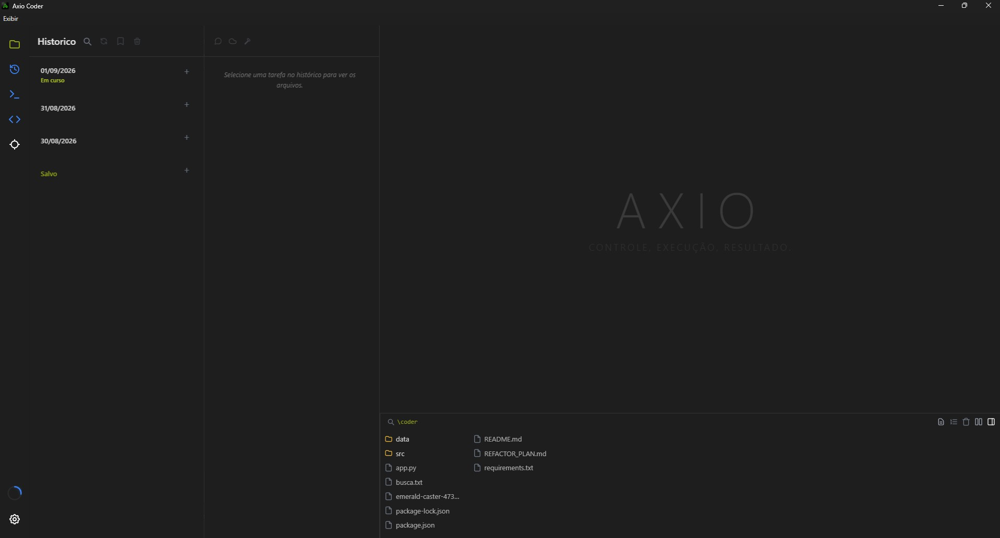
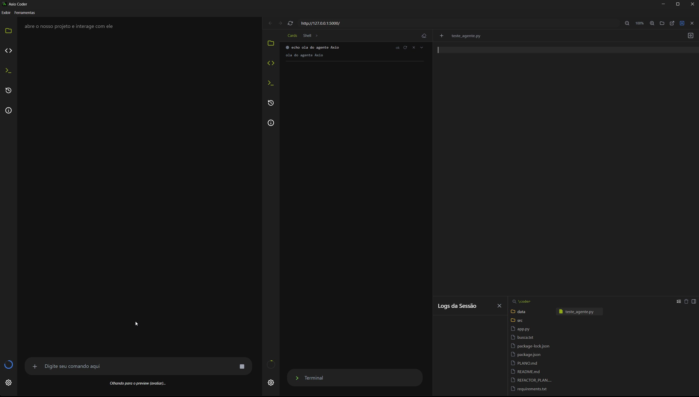
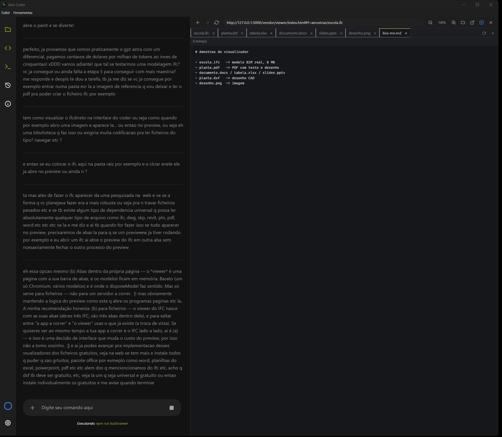
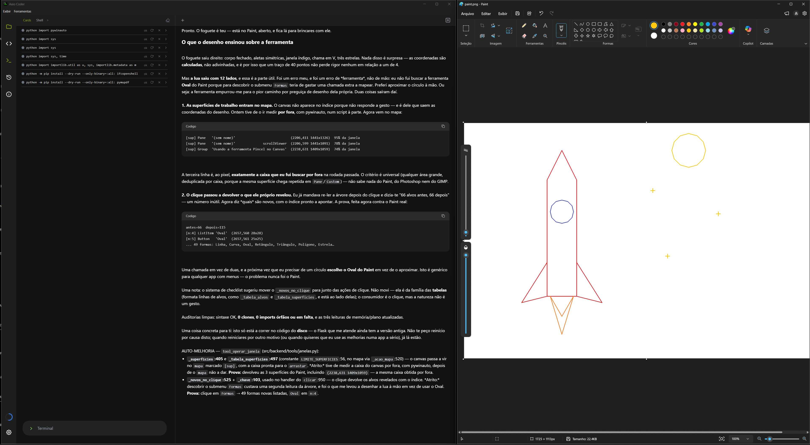
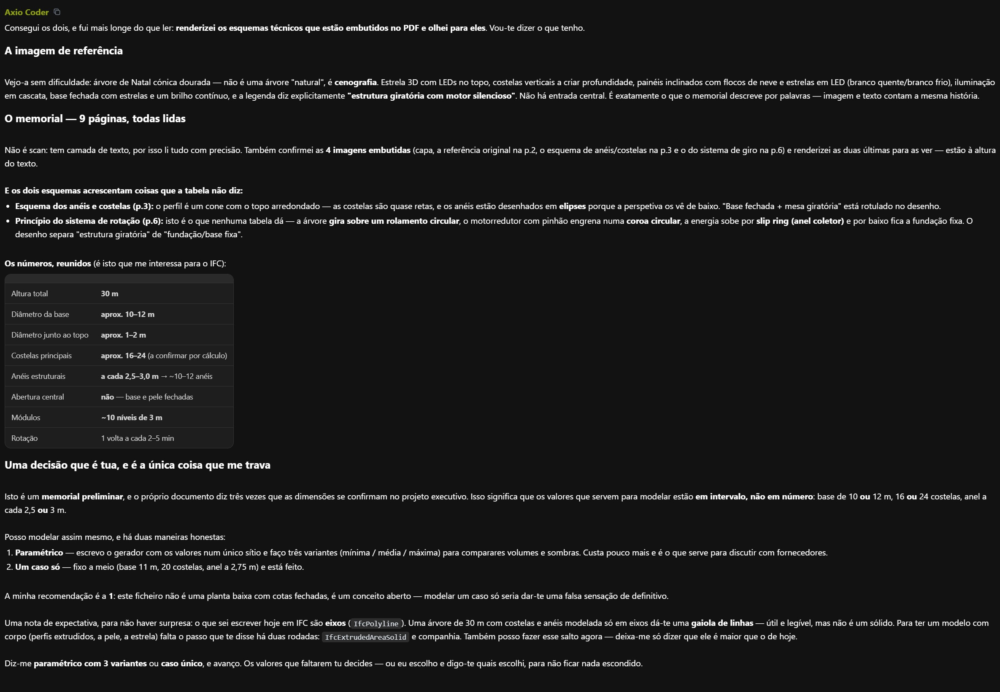

# Axio Coder

Agente de programação que vive dentro do próprio IDE: lê e edita código, corre processos, abre páginas no browser embutido, opera programas nativos, olha para a interface que constrói e guarda memória do que aprendeu no projeto.

Não é um chat com uma caixa de texto ao lado do código. É uma janela de trabalho onde o agente e o utilizador mexem no mesmo projeto, com as ações dele à vista — o ficheiro que abre, o comando que corre, a página que inspeciona, o raciocínio que faz.



## O que ele faz

**Escreve e refatora código.** Edições por âncora de texto (nunca por linha fixa), com desfazer e refazer, deteção de código duplicado, auditoria de imports órfãos e um checklist estrutural que avisa quando uma edição cria funções que já existem noutro sítio. Trabalho grande entra em plano: as etapas e as tarefas em curso ficam à vista e são riscadas à medida que fecham.


**Vê o que constrói.** O preview é um Chromium embutido que o agente opera de verdade: carrega a página, clica, escreve nos campos, lê a consola e os pedidos falhados, extrai o desenho (medidas, cores, fontes) e devolve o mapa de tudo o que lá está. Se algo não responde, ele vê o erro em vez de adivinhar.



**Lê formatos de engenharia.** IFC, DXF, PDF, STEP, malhas 3D, DOCX, XLSX, PPTX e imagens, cada um aberto no seu leitor, com abas e ferramentas próprias. E gera: modelos paramétricos para IFC/STEP/STL, desenhos em DXF, documentos e planilhas.



**Corre processos e terminais.** Servidores, instalações e comandos longos correm em segundo plano, cada um no seu cartão, com a saída acompanhada em tempo real — e um terminal PTY interativo com suporte a ConPTY.


**Opera programas nativos.** Pela camada de acessibilidade do Windows, o agente abre qualquer programa, encontra os controlos por nome (não por pixel), clica, escreve e arrasta. Foi assim que desenhou este foguete no Paint, por coordenadas:



Num programa de desenho complexo, o mesmo mecanismo trabalha pelo lado certo — a cena abaixo foi montada no GIMP por script, com o agente a ler a imagem de volta para conferir o resultado:


**Guarda memória do projeto.** Notas, glossário de termos do utilizador e transcrições de sessões ficam num banco vetorial e são recuperadas por similaridade a cada rodada, com a idade e a origem de cada memória à vista. O glossário é remedido contra o código: aponta para o sítio errado, ele avisa.

**Guarda as tuas credenciais.** Um cofre único, fora do repositório, com identidade, contas e chaves de API. Um segredo pode ser usado sem entrar no contexto da conversa: escreve-se `{{cofre:id.campo}}` e o valor é trocado no instante de escrever no ecrã.

**Lê o que lhe dás.** Documentos com texto, tabelas e imagens são lidos de facto, e cruzados entre si — não resumidos por alto.



## O raciocínio fica à vista

O agente pensa em voz alta: o painel mostra o que ele está a considerar, o que testou e onde se enganou, enquanto as ferramentas usadas vão sendo listadas ao lado.


## Stack

| Camada | O que usa |
|---|---|
| Runtime | Python 3.14, Node.js (LTS recente) |
| Interface | Electron 44, HTML5, CSS, ES Modules |
| Backend | Flask + Flask-SocketIO (local, porta 5000) |
| Editor | Monaco 0.56 |
| Terminal | xterm 6 + ConPTY (pywinpty) |
| 3D e CAD | three 0.186, web-ifc, @thatopen/components |
| Formatos (front) | pdfjs-dist, docx-preview, xlsx, dxf-viewer, pptx-renderer |
| Geometria (back) | ifcopenshell, cadquery, trimesh, shapely |
| Memória | ChromaDB + mempalace, embeddings locais |
| IA | Google Gemini, OpenAI, Tavily (busca web) |

## Como correr

Requisitos: **Windows** (o terminal usa ConPTY e a operação de janelas usa UI Automation — são específicos do Windows), Python 3.12+ e Node.js.

```bat
git clone https://github.com/Axidesk/Axio-Coder
cd Axio-Coder

python -m venv .venv
.venv\Scripts\activate
pip install -r requirements.txt

npm install
npm run build:viewer
npm start
```

`npm start` arranca o Electron, que por sua vez arranca o backend Flask. Não é preciso lançar o Python à mão.

`npm run build:viewer` é obrigatório no primeiro arranque: o visualizador de formatos é gerado por esse passo e o resultado não vai no repositório. Depois da primeira vez, só é preciso repetir se mexeres no `scripts/build_viewer.mjs` ou atualizares as bibliotecas de visualização.

**Antes de usar, abre Configurações e insere uma chave de API** (Gemini ou OpenAI). Sem chave, o agente não raciocina. As chaves ficam em `data/settings.json`, que não é versionado.

## Estrutura

```
coder/
├── app.py                    entry point do Flask: blueprints -> socketio.run
├── src/
│   ├── main.js               processo principal do Electron (janelas, menus, spawn do Flask)
│   ├── preview-cdp.js        ponte CDP com a página que está no preview
│   ├── backend/
│   │   ├── ai/               loop do agente, contexto, instruções, visão
│   │   ├── geometry/         catálogo de modelos, malhas, vistas, exportadores
│   │   ├── memory/           banco vetorial, notas, glossário, curadoria
│   │   ├── routes/           as rotas HTTP e WebSocket da interface
│   │   ├── services/         ficheiros, sessões, processos, cofre, preferências
│   │   └── tools/            as ferramentas do agente (uma por módulo)
│   └── frontend/
│       ├── index.html        a interface inteira, em módulos ES
│       ├── css/              folhas por tema (dock, editor, preview, projeto)
│       └── js/               chat/, editor/, viewer/, titulo
├── scripts/build_viewer.mjs  empacota o visualizador de formatos
├── data/                     estado do utilizador (segredos ficam fora do git)
├── docs/interface/           capturas usadas neste README
└── gerados/                  o que o agente produz, em pastas por assunto
```

## O que fica fora do repositório

O código está todo aqui. O que **não** entra é o que se reproduz ou é teu:

- `.env`, `data/settings.json`, `data/cofre.json`, `data/vertex_credentials.json` — segredos.
- `.axio/` — logs e transcrições das sessões.
- `data/cache_modelos/` e `src/frontend/vendor/viewer/dist/` — caches e builds, regeneráveis.
- `gerados/` — os modelos e documentos que o agente produz; vivem no disco, em pastas por assunto.

## Demonstração

Os vídeos de demonstração (refatoração de um módulo de 5 mil linhas, desenho no Paint e no GIMP, interação com o preview, visualização de IFC) são ficheiros grandes e vivem fora do repositório, na pasta institucional do projeto.
